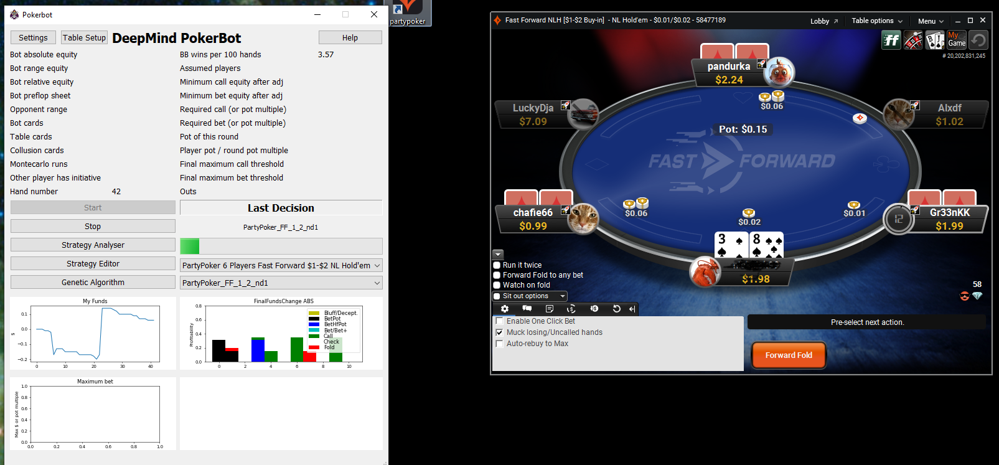
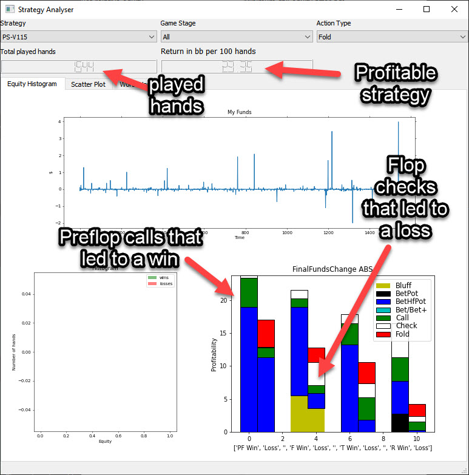
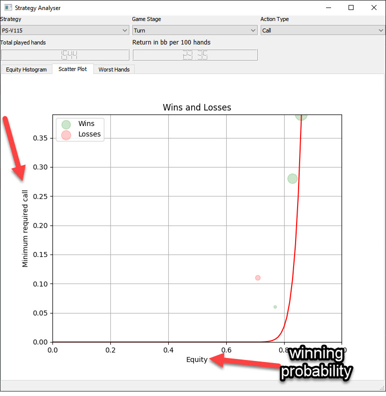

Deep mind pokerbot for pokerstars and partypoker
================================================

This pokerbot plays automatically on Pokerstars and Partypoker.
It works with image recognition, montecarlo simulation and a basic genetic algorithm.
The mouse is moved automatically and the bot can play for hours.

Please note that the table scraping needs updating as the layouts have
changed on both pokerstars and partypoker. Also, to train the bot I have started a new project here:
https://github.com/dickreuter/neuron_poker. The goal is to train agents by
playing against each other. Please contribute by creating a new Agent.

Usage:
------

Run:

-  Install Anaconda with python 3.6. I would also recommend to install pycharm.
- ``pip install -r requirements.txt``
- Run ``main.py``

For a start please make sure of the following:

Use Partypoker standard setup. Currently, the bot only works on tables with 6 people and where the bot is always sat at the bottom right.
Put the partypoker client (inside the VM) and the bot outside the VM. Put them next to each other so that the bot can see the full table of Partypoker.
In setup choose Direct Mouse Control. It will then take direct screenshots and move the mouse. If that works, you can try with direct VM control.
Start with a table like Supersonic2 on Partypoker where the stakes are low ( In the strategy editor create a copy of a Supersonic2 strategy and edit it yourself so that you win.
The bot may not work with play money as it's optimised on small stakes to read the numbers correctly.

Strategies
----------
The decision is made by the Decision class in decisionmaker1.py. A variety of factors are taken into consideration:

- Equity (winning probability), which is calculated by Montecarlo_v3.py (will be replaced with a faster numpy-only version in Montecarlo_v4.py)
- Equity and minimum call/bet value need to be on the left of the corresponding curve in order for the bot not to fold
- Various other factors, such as behaviour in the previous round are taken into consideration

Packages and modules:
~~~~~~~~~~~~~~~~~~~~~

main.py: entry point and command line interpreter. Runs agents with the
gym.

Coordinates file: coordinates.json
^^^^^^^^^^^^^^^^^^^^^^^^^^^^^^^^^^

screen_scraping:

- get_other_player_pots: Start with the player after the bot and move clockwise forward
- get_other_player_status: Start with the player after the bot and move clockwise forward
- get_dealer_position: This one goes counter clockwise and starts with 3 players before the bot, which is the player that is the dealer when the bot is UTG. The second entry is the dealer position when the bot is UTG+1

mouse_mover

The mouse mover describes where the mouse needs to move to when action is taken. Please note that it is randomized. The system works as follows: [1,0,419,493,100,35] means

[repetition, delay in secs, x1,y1,width,height]
Each mouse action can have several buttons, for example bet plus means it fist presses the plus button several times and then goes on to press raise.

- BetPlus:3, 0.3, 673, 465, 30, 10],[1,0, 675, 492, 100, 31. This means, press the plus button 3 times (with the top left coordinates of the button, and then how wide and high the button is for the randomization, wait for 0.3 seconds and then move on to press the raise button once.
- Bet Bluff: This will be the same as the raise button (bet)
- Call2: All in call button, is where usually the raise button is in pokerstars

Edit or fix the coordinates

In case of a poker software update, the elements positions would move on screen, you can help the scraper to find accurate image elements bounds:

Before taking screenshots of virtual machine, be sure to setup the poker software correctly

1) Extract the coordinates to SVG files

- go to table folder
- cd /Poker/poker/tables
- take a screenshot of your VM with the poker software inside (you can find some in your poker/log/screenshots folder), the shot needs its top left corner to be guessable by the scraper (ie the poker bot logs " - table - DEBUG - Top left corner found"))

2) save it to /Poker/poker/tables/backgrounds/{TABLE_NAME}.png where TABLE_NAME depends on the table you want to edit (PS2, PS, SN, PP)

Transform the coordinates.json into svg files :

2) edit the coordinates
edit the coordinates file(s) created in /Poker/poker/tables/templates/.svg with inkscape

You can then move and scale the element groups of the svg files with inkscape, it doesn't matter if the text is also scaled. If you delete a foreground element to edit the ones behind, it won't delete the element in coordinates.json file, it's coordinates just won't be updated.

You may want to change the image in background in order to visualize all the elements. Hit Edit -> xml editor in inkscape. In the xml view, click on the group with id="background", edit the xlink:href value and set it to your background image path.

3) test the scraper results
python 2-scrapingTester.py
If the zones extracted by the scraper are incorrect, move the stuff again in the .svg files
4) Save the edited coordinates back to the coordinates.json file
python 3-save_svg_back_to_coordinates.py

poker.tools
^^^^^^^^^^^

-  ``hand_evaluator.py``: evaluate the best hand of multiple players
-  ``helper.py``: helper functions
-  ``montecarlo_numpy2.py``: fast numpy based montecarlo simulation to
   calculate equity. Not yet working correctly. Some tests are failing. Feel free to fix them.
-  ``montecarlo_python.py``: relatively slow python based montecarlo for equity calculation. Supports
   preflight ranges for other players.

poker.tests
^^^^^^^^^^^

-  ``test_montecarlo_numpy.py``: tests for the numpy montecarlo
-  ``test_pylint.py``: pylint and pydoc tests to ensure pep8 standards and static code analysis

How to contribute
~~~~~~~~~~~~~~~~~

Github
^^^^^^

It will be hard for one person alone to beat the world at poker. That's
why this repo aims to have a collaborative environment, where models can
be added and evaluated.

To contribute do the following:

- Get Pycharm and build the virtual python environment. Use can do: ``pip install -r requirements.txt``
- Clone your fork to your local machine. You can do this directly from pycharm: VCS --> check out from version control --> git
- Add as remote the original repository where you created the fork from and call it upstream (the connection to your fork should be called origin). This can be done with vcs --> git --> remotes
- Create a new branch: click on master at the bottom right, and then click on 'new branch'
- Make your edits.
- Ensure all tests pass. Under file --> settings --> python integrated tools switch to pytest. You can then just right click on the tests folder and run all tests. All tests need to pass. Make sure to add your own tests by simply naming the funtion test\_... \
- Make sure all the tests are passing. Best run pytest as described above (in pycharm just right click on the tests folder and run it). If a test fails, you can debug the test, by right clicking on it and put breakpoints, or even open a console at the breakpoint: https://stackoverflow.com/questions/19329601/interactive-shell-debugging-with-pycharm
- Commit your changes (CTRL+K}
- Push your changes to your origin (your fork) (CTRL+SHIFT+K)
- To bring your branch up to date with upstream master, if it has moved on: rebase onto upstream master: click on your branch name at the bottom right of pycharm, then click on upstream/master, then rebase onto. You may need to resolve soe conflicts. Once this is done, make sure to always force-push (ctrl+shift+k), (not just push). This can be done by selecting the dropdown next to push and choose force-push (important: don't push and merge a rebased branch with your remote)
- Create a pull request on your github.com to merge your branch with the upstream master.
- When your pull request is approved, it will be merged into the upstream/master.

Roadmap
-------
- [x] Build a framework that can play online
- [ ] Fix pylint errors and imporve code quality
- [ ] Update the pokerbox to the new table format of partypoker
- [ ] Update the pokerbox to the new table format of pokerstars
- [ ] Add more strategies

FAQ
---

Why is the bot not working?

-  It only works on windows currently
- It only works with fast forward games with real money on PartyPoker. Use the Supersonic3 table for Partypoker or McNaught table in Pokerstars
- The poker table window has to be fully visible and cannot be scaled, otherwise it won't be detected properly
- In Partypoker, when you open the table, choose table options and then choose **back to default size** to make sure the table is in default size.

What about Pokerstars?

- Almost ready. Check the wiki how you can help.

Errors related to the virtual machine

- Go to setup and choose direct mouse control.

Do I need to use a virtual machine?

- For Pokerstars you definitely do, otherwise you will be blocked and your account will be frozen within minutes. For Partypoker I'm not sure. But it's probably a good idea.

The bot does not recognize the table and doesn't act

- Make su**re everything looks exactly like in the picture below. The buttons need to look exactly like this and it needs to be in English and not scaled. Colours need to be standard.**

Still having problems?

- Check the log file. In the folder where you installed the pokerbot, there is a subfolder with the log files in /log. There are also screenshots in /log/screenshots that may be able to help debug the problem. Please contact me on google hangout under dickreuter@gmail.com.